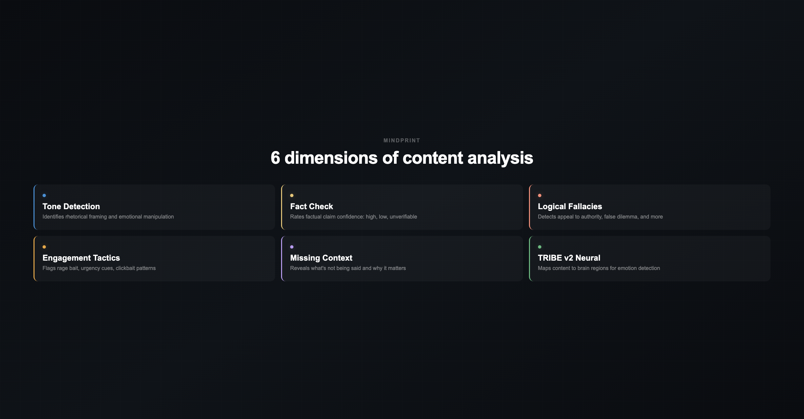

# MindPrint

**See through content manipulation. On any website.**

MindPrint is a Chrome extension that analyzes news articles and social media posts to reveal how content is engineered to influence you. It detects emotional framing, checks factual claims, identifies logical fallacies, flags engagement tactics, and surfaces missing context -- all in one click.


## What it does

**Scan headlines** -- click "Scan this page" on any news site. MindPrint uses Claude to identify headlines, then classifies each one's intended emotional reaction (outrage, fear, curiosity, hope, sadness, pride, amusement, disgust, or neutral). Badges appear inline next to each headline.

**Deep content analysis** -- click "Analyze" on any article or social media post. MindPrint extracts the content and runs it through 6 analysis dimensions:

| Dimension | What it detects |
|-----------|----------------|
| **Tone** | Rhetorical framing, emotional language, persuasion techniques |
| **Fact Check** | Factual claims rated as high/medium/low confidence or unverifiable |
| **Logical Fallacies** | Appeal to authority, false dilemma, hasty generalization, etc. |
| **Engagement Tactics** | Rage bait, urgency cues, clickbait, "share if you agree" patterns |
| **Missing Context** | Unsourced claims, selective framing, old content without dates |
| **TRIBE v2 Neural** | Brain-region emotion mapping via Meta's cortical prediction model |

Results appear in a dark sidebar panel with expandable sections, evidence quotes, and confidence badges.



## Supported platforms

MindPrint works on **any website**. Platform-specific extractors provide richer analysis on:

- **X (Twitter)** -- extracts post text, author verification, engagement counts, quoted tweets
- **Instagram** -- extracts captions, hashtags, author info, engagement metrics, image alt text
- **News articles** -- extracts full article body with structural context (BBC, Reuters, any site)

## How it works

Two engines power the analysis, selectable in the popup:

1. **TRIBE v2 (self-hosted)** -- Meta's brain-predictive foundation model deployed on Modal with GPU. Maps text to predicted cortical activity, then scores emotions via an ROI heuristic. Used for the neural tone analysis dimension.
2. **Claude** -- Anthropic's API for headline extraction, deep content analysis (Sonnet), and emotion classification (Haiku). Required for the "Scan" and "Analyze" features. Optional fallback for TRIBE.

```
User clicks "Analyze"
       |
       v
Content Script ── extracts page content (platform-aware)
       |
       v
Background SW ── runs in parallel:
       |            |
       v            v
   TRIBE v2     Claude Sonnet
   (tone)       (full analysis)
       |            |
       v            v
       Merge results
       |
       v
Sidebar panel injected into page
```

## Setup

### Prerequisites

- Google Chrome (or Chromium-based browser)
- An [Anthropic API key](https://console.anthropic.com/) (required for Scan + Analyze features)
- Optional: [Modal](https://modal.com) account for TRIBE v2 backend

### 1. Install the extension

```bash
git clone https://github.com/attila-aranyi/mindprint.git
cd mindprint
```

Go to `chrome://extensions` -> enable **Developer mode** -> click **Load unpacked** -> select the cloned folder.

### 2. Configure

Click the MindPrint icon in the toolbar:

1. **Set your API key** -- paste your Anthropic `sk-ant-...` key and click Save. This is required for both headline scanning and deep analysis.
2. **Choose an engine**:
   - **Claude (BYOK)** -- works immediately, no backend needed. Good for getting started.
   - **TRIBE v2 (self-hosted)** -- requires deploying the backend (see below). Provides neural brain-region analysis as an additional dimension.

### 3. Deploy the TRIBE backend (optional)

TRIBE v2 adds a neural tone analysis dimension by mapping content to predicted brain cortical activity. Skip this if you only want Claude-based analysis.

```bash
cd backend
pip install modal
modal token new          # one-time browser auth
```

You need access to Meta's Llama 3.2 3B model (TRIBE v2 dependency):
1. Go to [huggingface.co/meta-llama/Llama-3.2-3B](https://huggingface.co/meta-llama/Llama-3.2-3B) and accept the license
2. Create a [HuggingFace token](https://huggingface.co/settings/tokens) with read access
3. Add it as a Modal secret:
   ```bash
   modal secret create huggingface HF_TOKEN=hf_your_token_here
   ```

Deploy:
```bash
modal deploy modal_app.py
```

Modal prints a URL like `https://<workspace>--mindprint-tribe-web-fastapi-app.modal.run`. Paste it into the extension popup under **Backend URL**, click **Save**, then **Test /health**.

See [`backend/README.md`](backend/README.md) for local development, cost estimates, and tuning options.

## Usage

### Scanning headlines

1. Navigate to any news site or page with headlines
2. Click MindPrint icon -> **Scan this page**
3. Headlines are extracted via Claude, classified in batches, and badges appear inline
4. Hover a badge for confidence and reasoning

### Analyzing content

1. Navigate to any article, X post, or Instagram post
2. Click MindPrint icon -> **Analyze**
3. A sidebar appears with 6 expandable analysis sections
4. Click any section header to expand and see evidence, quotes, and detailed reasoning

### Settings

- **Engine toggle** -- switch between TRIBE v2 and Claude for emotion classification
- **Fall back to Claude** -- if TRIBE fails, automatically retry with Claude
- **Clear cache** -- clears all cached classification results

## Emotion taxonomy

| Label | Hint |
|-------|------|
| outrage | anger at a group, person, or policy |
| fear | worry about a threat or danger |
| curiosity | intrigue, clickbait mystery |
| hope | optimism, positive change |
| sadness | empathy, grief, loss |
| pride | in-group affirmation, accomplishment |
| amusement | humor, lightness, entertainment |
| disgust | moral or physical revulsion |
| neutral | informational, low emotional valence |

## Project structure

```
manifest.json            Chrome MV3 manifest
background.js            Service worker: engine dispatch, analysis orchestration, cache
content.js               DOM extraction, platform detection, badge + banner injection
content.css              Badge and analysis sidebar styles (light + dark)
popup.html/js/css        Extension popup UI

backend/                 TRIBE v2 backend (FastAPI + Modal)
  app.py                 FastAPI surface + in-process cache
  tribe_engine.py        TRIBE model wrapper (text -> cortex predictions)
  roi_mapping.py         Cortex predictions -> emotion via Destrieux atlas
  taxonomy.py            9-label taxonomy + per-label ROI profiles
  modal_app.py           GPU Modal deployment config
  requirements.txt       Python dependencies

video/                   Promo video (Remotion)
  src/                   Video compositions and scenes
  out/                   Rendered videos and images
docs/                    Design specs and implementation plans
```

## Privacy

- All settings, cache, and your API key are stored locally in `chrome.storage.local`. Nothing is synced.
- **Scan**: sends headline text to your chosen engine (TRIBE backend or Anthropic API). No URLs, no page content beyond headlines.
- **Analyze**: sends stripped article/post text to Claude Sonnet for analysis, and optionally the title to TRIBE. No images, no full HTML, no cookies.
- No analytics. No telemetry. No tracking.

## Known limitations

- **TRIBE inference is slow** -- each headline goes through TTS + audio alignment + neural inference (~seconds per headline on A10G). Use batching and cache.
- **Social media DOM changes** -- Instagram and X frequently update their DOM structure. The extractors use multiple fallback selectors but may need updates.
- **Fact-checking is LLM-based** -- Claude rates claim confidence from its training knowledge. It cannot verify breaking news or access external sources. "Unverifiable" is a valid and common rating.
- **TRIBE weights are CC BY-NC-4.0** -- the extension and backend are for personal/research/open-source use. Commercial deployment of TRIBE requires Meta's permission.

## Contributing

Issues and PRs welcome. Key areas for contribution:

- **Platform extractors** -- add support for Reddit, YouTube, TikTok, or improve existing X/Instagram selectors
- **Taxonomy tuning** -- the ROI-to-emotion mapping in `backend/taxonomy.py` is a first-pass heuristic
- **Image analysis** -- extending to Claude Vision for visual manipulation detection (Phase 2)

## License

Extension code: MIT. TRIBE v2 model weights: [CC BY-NC-4.0](https://creativecommons.org/licenses/by-nc/4.0/) (Meta).
